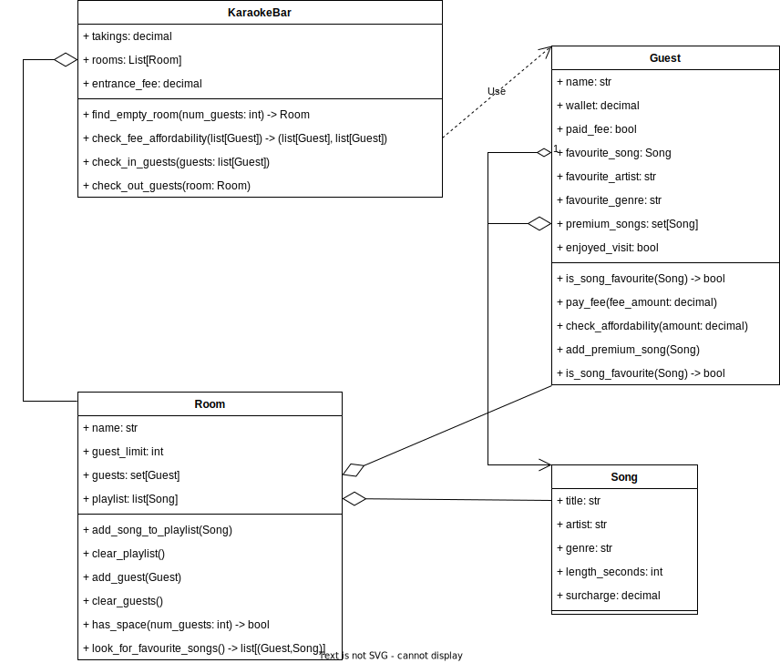
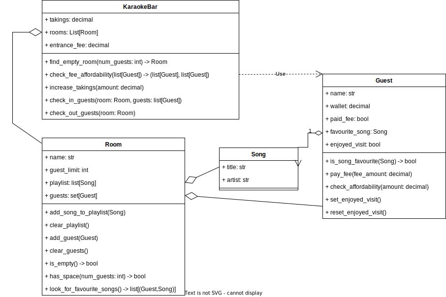
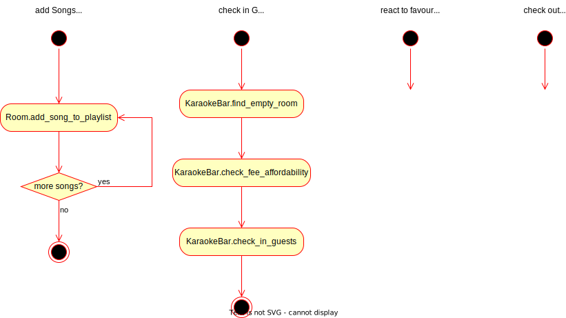

# CodeClan Caraoke (CCC)

## Brief

### MVP Requirements

Develop using OO and TDD principles.

* Objects:
    * Rooms
    * Songs
    * Guests
* Activities:
    * create Rooms, Songs, Guests
    * check in Guests to Rooms
    * check out Guests from Rooms
    * add Songs to Rooms

### Extensions

1. Rooms have limited free space for guests
2. manage entrance fees and Guests paying entrance fees
3. Guests reacting to Room playlists of their favourite Song
4. Rooms tracking fees/spending of Guests (eg. a bar tab?)

### REMINDER ABOUT PDA

Take screenshots from this homework for PDA.

## Implementation Plan

1. MVP:
    * Draw class diagram for MVP+1+3.
    * Setup skeleton code for runner, tests, classes
    * Sketch activities
    * Tests for object attributes
        * follow diagram
    * Tests for simple methods
        1. add Songs to Room / clear playlist
        2. is Room empty
        2. find empty Room in KaraokeBar
        3. add Guest to Room / clear Guests
        6. Guest can afford fee
        5. Guest pays fee
        6. increase KaraokeBar takings
    * Tests for complex methods / integration tests
        1. check fee affordability for Guests
        2. check in Guests to Room
        3. check out Guests from Room
    * Extension methods
        1. has space in Room
        2. is Song a favourite of the Guest
        6. flag Guests as having (not) enjoyed visit
        6. find favourite Songs of Guests in Room
        7. react to Guests when checking out
2. Simple `runner.py`
2. Extension 1
3. Extension 3
4. Extensions 2 and 4.

### Thoughts/Notes

Is there something managing the Songs?  eg. a SongCatalogue?

Is there a KaraokeBar that has a SongCatalogue and Rooms?

Is Playlist a separate object?  Maybe the SongCatalogue also has
playlists that are cloned to setup a room?

Find a room with enough space for a group of people.  Or at least, find
an empty room for them.

<b>The above are out-of-scope for the MVP.</b>

## Diagrams

<!--  -->

----
XXX: ✓